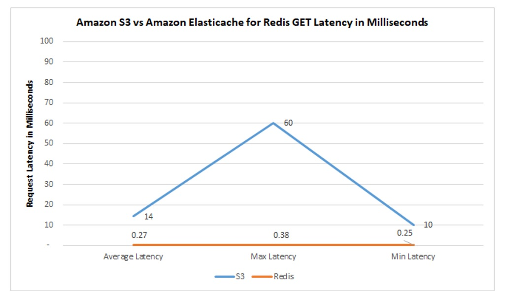

# Caching Amazon S3 with Amazon ElastiCache for Redis

This sample project demonstrates how you can cache [Amazon S3](https://aws.amazon.com/s3/) objects with [Amazon ElastiCache for Redis](https://aws.amazon.com/elasticache/redis/) . This project also uses [AWS CloudFormation](https://aws.amazon.com/cloudformation/) & [AWS Cloud9](https://aws.amazon.com/cloud9/) as means to deploy, build and run this tutorial, although you can run this in your own environments as well.

These examples are also referenced in the following blog:TBD which provide background and context to this project. It is recommended to read the blog as a pre-requisite.

## Deployment

1. Download from github, then run (upload) the following CFN template with AWS CloudFormation: [cfn/S3RedisCFN.yaml](https://raw.githubusercontent.com/aws-samples/amazon-S3-cache-with-amazon-elasticache-redis/master/cfn/S3RedisCFN.yaml)

2. Upon running the CFN, you will be prompted to enter a Subnet Id for AWS Cloud9 and Amazon ElastiCache to be launched in. Enter a subnet id to use and then click next, next, create. (Note: This step ensures that both services are running within the same availability zone for optimal performance. You can find your subnet ids within the Amazon VPC console.)

## Setup and Build

1. Upon CFN completion, take note of the generated S3 Bucket name and the ElastiCache Redis endpoint within the cloudformation outputs tab. Then navigate to AWS Cloud9 and open the **S3RedisCache** IDE environment.

2. Within the AWS Cloud9 environment, open (+) a new terminal and clone this repository:

   ```git clone git@github.com:aws-samples/amazon-S3-cache-with-amazon-elasticache-redis.git``` 

3. Navigate to the downloaded setup directory (/amazon-S3-cache-with-amazon-elasticache-redis/setup) and run the following script to further prepare your environment:
 
   ```sh s3_redis_project_setup.sh  ```

 4. Navigate to the resources directory (amazon-S3-cache-with-amazon-elasticache-redis/resources) and update the following properties within **constants.py**. Provide the generated resource values you captured in the cloudformation outputs: 

   ```
      redishost="" (leave out the port)
      S3bucket= "" 
   ```
 5. Next run **load_data.py**. This will generate and load 100 objects into both Amazon S3 and Amazon ElastiCache for Redis

 6. Next run **query_redis.py** and **query_S3.py** and compare the generated latency. 

 You will notice a significant performance improvement when querying redis vs S3. This performance test is intended to be lightweight and only for illustration purposes. Your results may slightly vary based on your environment. An example comparison between the two services in milliseconds is as follows:

 

## Lazy-load example

A common caching technique often used is lazy loading. This approach assumes data is cached and if not, retrieves data from the origin data source, then caches the data future requests. In order to illustrate this example we must first flush the redis cache.

1. run **flush_redis.py** (this deletes all your keys)

2. Next run **lazy_load.py** found within the following directory (amazon-S3-cache-with-amazon-elasticache-redis/examples/lazyload). Upon first run, you should notice a cache MISS upon first run. Run it again and the following request will return a cache HIT.

## Terminate your environment

Upon running these examples, terminate your environment by the following steps:

1. run **delete_S3_objects.py** (this deletes all the generated S3 objects)

2. Within the AWS CloudFormation console, delete the stack you launched. 
 

